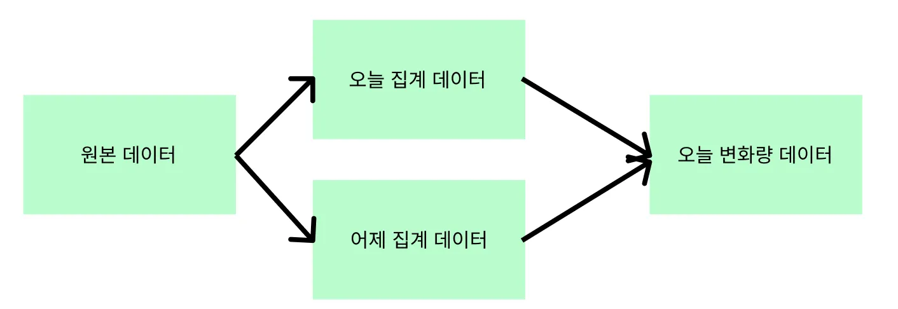
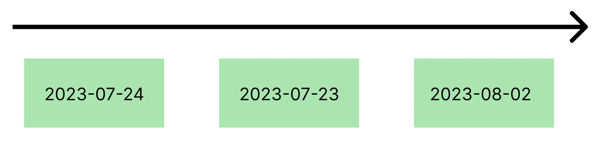

## 문제 상황
기존 원본 데이터는 크롤링을 통해서 수집하고 있는 상황이었는데 Airflow를 이용한 배치 시스템 자체를 이후에 적용했습니다.  
그래서 Airflow에 있는 Backfill 기능을 사용해 기존 원본 데이터를 채웠습니다만..!  
데이터가 원하는대로 들어가지 않았습니다..  
예시로 들면, 2023-07-23 데이터와 2023-07-24 데이터의 차이가 원래 1000이라고 한다면 막상 2023-07-24 변화량 값의 데이터는 모두 다 기본값인 0으로 들어가 있었던 거죠.  
> 물론 이렇게 구현하지 않았을 수도 있었겠지만.. 저는 하루의 데이터 집계의 저장과 변화량 데이터를 한 번에 구현했었습니다. <br>만약 하루 집계 데이터와 변화량 데이터를 분리한다면 집계한 데이터를 먼저 Backfill을 실행하고, 변화량 데이터를 나중에 Backfill을 실행했다면 문제가 발생하지 않았을 겁니다만!  <br>위와 같이 실행한다고 하더라도 집계한 데이터의 Backfill을 먼저 실행하고 그 다음 변화량 데이터를 Backfill해야 하는 순서상의 의존은 변하지 않기 때문에 이대로 따로 분리하지는 않았습니다. 

<div class="source">단순화한 현재 Airflow의 taskflow</div>

## 원인 파악하기 
이유는 요구사항이 전날 데이터를 기준으로 데이터 차이의 결과를 구해야 했는데 이 때 오늘 데이터는 하루 전날 데이터를 의존하게 됩니다.  
저는 병렬로 실행하는 CeleryExecutor를 사용하고 있었고, Backfill의 실행 순서는 랜덤으로 실행이 됩니다.  
하지만 이 사실을 모른 저는 Backfill을 진행했고, 위와 같은 문제 상황에 마주한 것입니다.

<div class="source">Backfill했을 때 시간 순서상이 아닌 랜덤</div>
위와 같이 진행이 된다면 2023-07-24에 Dag를 실행할 때 어제 집계데이터가 없으므로 변화량 데이터를 정확하게 나오지 않게 됩니다.  

이제 원인을 알았으니!! 해결을 해보러 갑시다! 

## 해결하기!
Backfill은 실행순서가 랜덤으로 실행되므로 날짜 순으로 실행하게 만든다면 문제가 해결될 것입니다.  
그래서 Backfill을 순서대로 실행시키게 만들겠습니다.  
DAG의 default_args를 `depends_on_past = True`로 만든다면 Backfill은 순서대로 실행하게 됩니다.

<div class="code-header">
	<span class="red btn"></span>
	<span class="yellow btn"></span>
	<span class="green btn"></span>
</div>

```python
with DAG(
    dag_id = 'backfill_chronologically',
    start_date = datetime(2023,8,6), 
    ...
    default_args = {
        'depends_on_past': True,
    }
```
이렇게 DAG를 수정하고 실행하니 문제가 없이 동작하였습니다!!


혹시나 다른 좋은 방법이 있다면 댓글로 알려주시면 감사하겠습니다!
