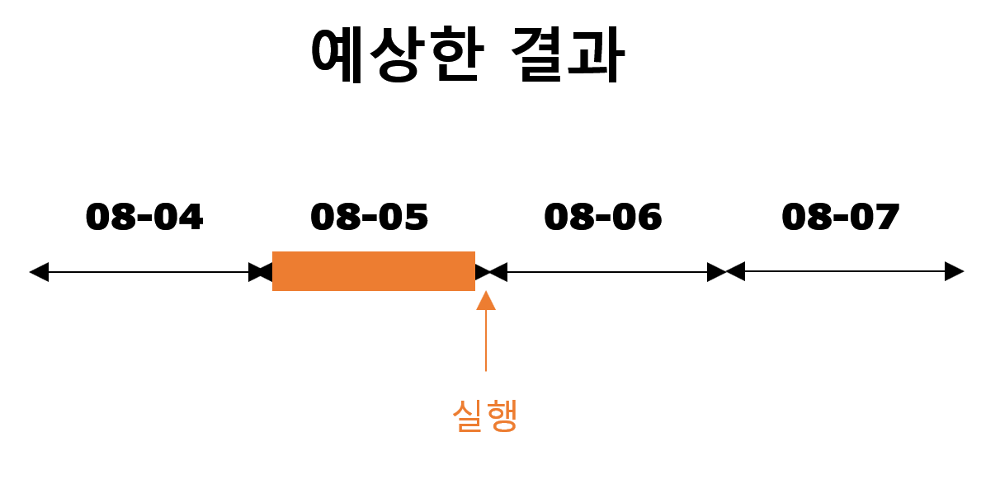
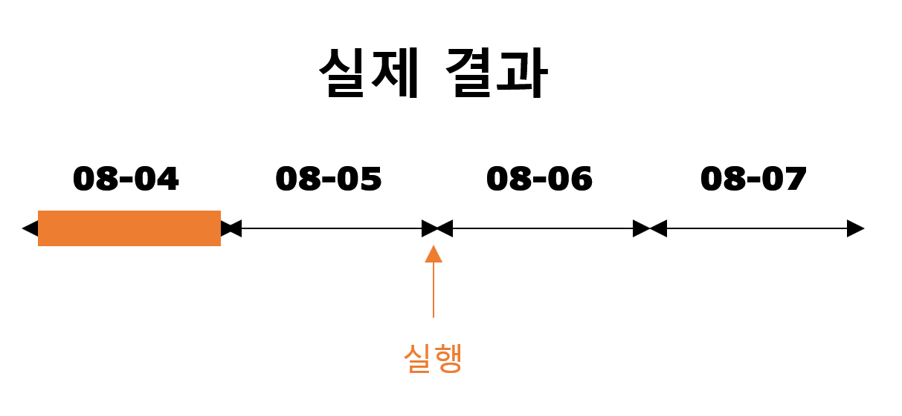
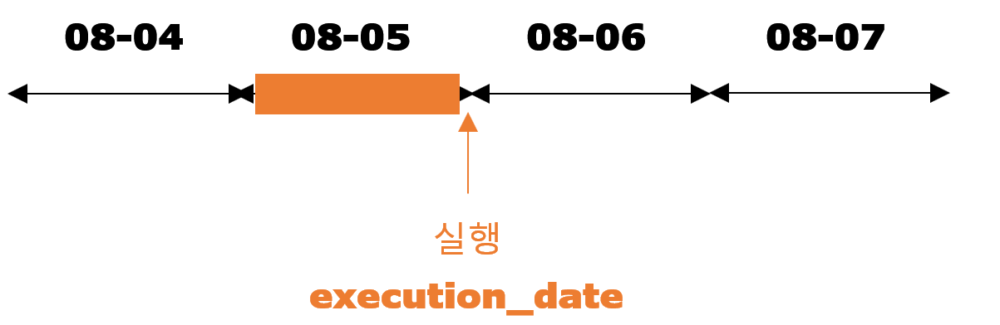
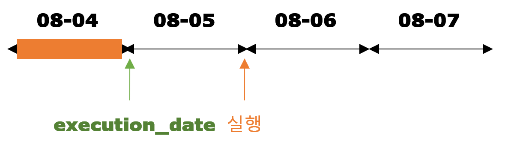
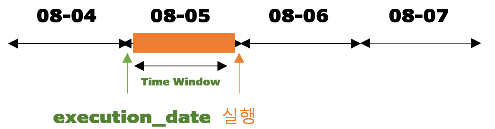
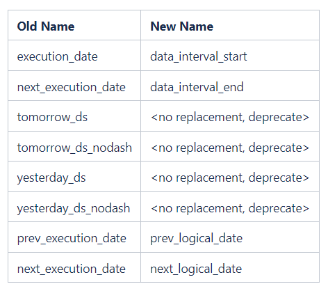
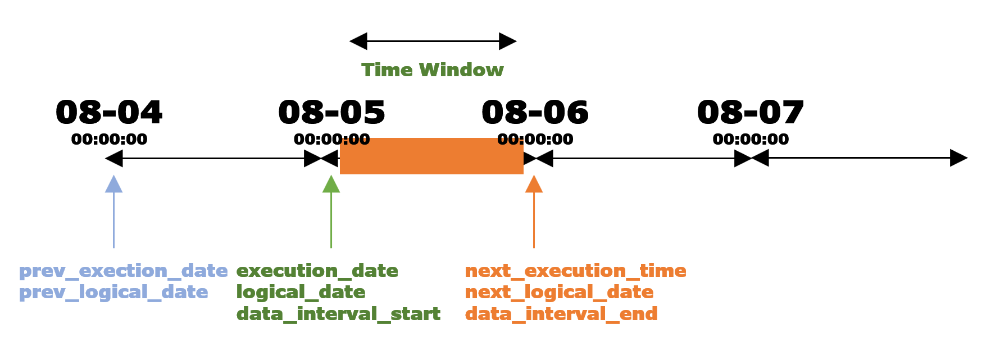

## 문제 상황
회사에서 배치 프로세스 작업으로 일단위 데이터 집계를 하기 위해 Airflow를 사용하고 있습니다. 저는 Execution Date를 당연하게 배치 프로세스의 작업 시간이라고 생각하고 스케줄링을 했었습니다..!
  
그렇지만 무슨일인지 원하는 대로 동작이 되지 않고, 오늘이 만약 8월 6일이면 전날 데이터인 8월 5일 데이터를 집계할 줄 알았지만 8월 4일의 데이터를 집계하고 있었습니다.  


## 왜 이런 문제가 발생할까?
바로 Execution Date를 제가 잘못 알고 있었기 때문입니다.  
Execution Date는 제가 생각한대로 실행하고 있지 않았습니다.  
제가 착각한 부분은 실행 시각과 execution_date의 시간이 같은 줄 알고 프로그래밍을 했습니다..!  

<div class="source">제가 생각했던 execution_date</div>

8월 6일 00시에 실행하는 Execution Time은 print를 해보니 8월 5일 00시에 찍혀있었습니다.  

<div class="source">실제 execution_date</div>

Airflow에는 TimeWindow라는 처리해야할 데이터의 기간인 개념이 있습니다.  
예를 들어, 8월 5일날 이커머스의 일일 매출을 집계하는 배치 작업이 있다고 합시다.  
일일 매출을 계산하려면 4일이 끝나고 8월 5일 자정에 `08/04 00:00:00 ~ 08/04 23:59:59`까지의 발생한 매출을 계산해야 합니다!  
여기서 작업 대상이 되는 데이터는 8월 4일의 데이터(=`execution_date`)가 되고, 실제 작업이 실행되는 시간은 8월 5일 0시가 됩니다.



즉, `execution_date`는 해당 Task가 처리해야 할 데이터 기간의 시작 시점인 8월 4일을 의미합니다.  
`execution_date`라는 이름을 직역하면 실행 날짜가 되기 때문에 그 의미와 실제 의미가 달라서 혼란이 유발 됐었습니다..

## 어떻게 해결해야 할까?
### 1. execution_date 이해에 따라 수정
이건 해결방법 중 가장 쉬운 방법이지만 저만 오해가 풀린 걸 수도 있으므로 언젠가 코드를 유지보수할 다른 분들께서 또 오해의 소지가 있기 때문에 이 방법 스킵하도록 하겠습니다.
### 2. execution_date를 대체하기
execution_date를 대체하는 것이 좋은 방법이라고 생각됩니다.  
[confluence의 AIP39](https://cwiki.apache.org/confluence/display/AIRFLOW/AIP-39+Richer+scheduler_interval)에 보면 execution_date가 너무 오해에 소지가 있으니 새로운 이름을 명칭하는 내용이 있습니다.

<div class="source">새로운 명칭이름</div>
이 위에 표에는 없지만 execution_date와 같은 날짜를 가리키는 logical_date도 존재합니다.


<div class="source"> 다양한 Date</div>

위와 같이 이외에도 airflow에 정해진 date들이 있습니다.  

<div class="code-header">
	<span class="red btn"></span>
	<span class="yellow btn"></span>
	<span class="green btn"></span>
</div>

```python
// pendulum.DateTime 형식
date_time_start = {{data_interval_start}}
```
execution_date 대신 logical_date나 data_interval_start로 변경하여 코드를 수정하는 이 방법이 조금 더 좋아보여 이렇게 수정하였습니다.

## 깨달은 점
새로운 기술을 도입할 때 실보다 득이 많다고 생각하여 도입을 했지만, 오해할 만한 여지를 계속 내버려두고 데이터 체크를 하지 않았다면 장기적인 에러로 발전했을 것 같습니다..  
앞으로도 제 로직이 정확하다고 할지라도 테스트는 무조건 진행해야 한다고 생각합니다.  
이번처럼 exection_date가 제가 생각한 방향과 다르게 흘러갈 수 있으므로.. ㅠㅠ 
