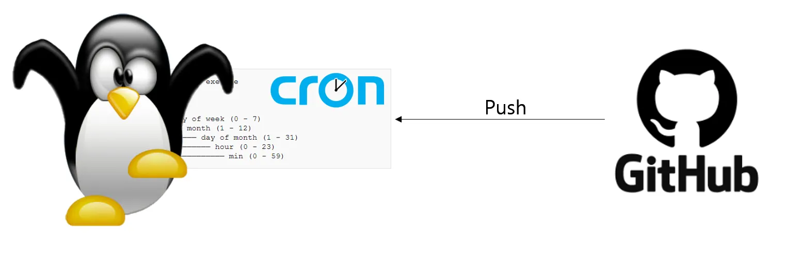
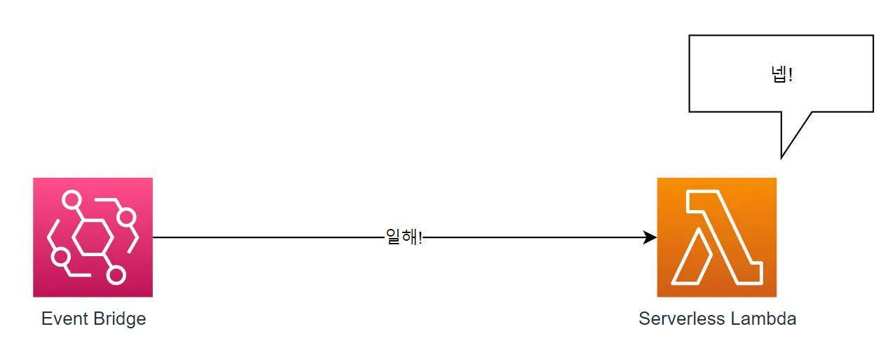
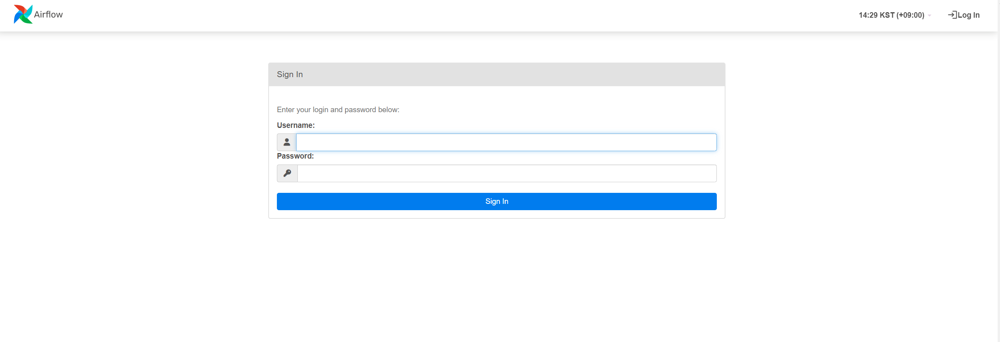
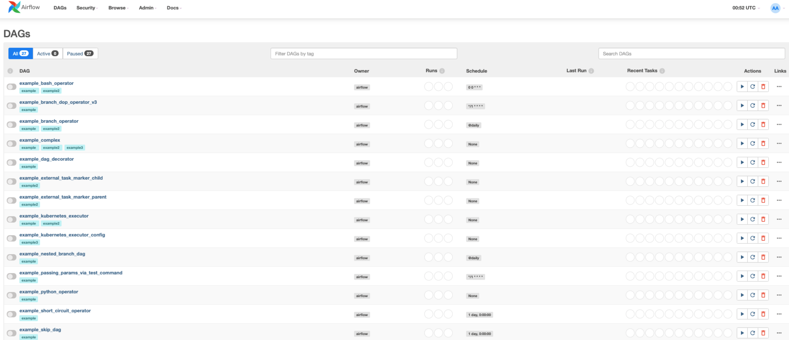
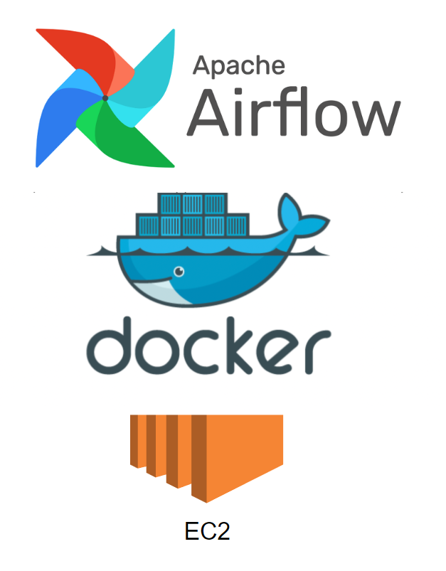

## 들어가기 전에
저는 회사에서 데이터를 배치하는 작업을 많이 했었습니다. 그 중에 처음으로 도전한 것은 바로 예전 학생 때 프로젝트했던 Linux Cron 배치 작업으로 배치 데이터를 프로세싱 중이었는데요.  
이것보다 더 좋은 것이 없을까하는 생각이 매번 들긴 했었습니다. 그 당시에만 해도 모든 서버를 온프레미스로 돌리고 있는 상황이었습니다!  
이렇게 하다보니 컴퓨터가 꺼지거나 배치 작업이 돌아가지 않을 때는 운영팀의 보고를 통해서만 받게 되었습니다.


<div class="source"> 온프레미스 당시 인프라</div>

회사에서 AWS 사용해보기로 결정이 됐습니다.  기존에 있던 배치 시스템을 변경할 기회였습니다.  
그래서 AWS에서 배치 작업을 더 좋게 처리하는 방법이 없을까하다가 Lambda + EventBridge로 처리하게 했었습니다.  
이번엔 Severless 서비스인 Lambda를 사용하니깐 컴퓨터가 문제일 경우는 없었습니다만 만약 데이터의 정합성의 문제로 에러가 발생한다면 기존의 배치 작업을 다시 돌려야하는 문제가 생겼습니다.

<div class="source"> AWS 당시 인프라</div>

그러다가 데이터 엔지니어링에 대해 관심을 가지고 있었습니다. 그 중 Airflow라는 기술이 있었는데요. Airflow는 이전에 했던 배치 시스템의 단점들을 보완하고 있었습니다..!  
그래서 이번 글에서는 Airflow를 설치하는 방법과 Git Action으로 AWS EC2에 배포하는 방법을 알아보겠습니다.  
~~왜 AWS EC2냐고 하면 .. 제가 쓰고 있는 환경이라서..~~

#### 참고한 글 
[Airflow 공식문서](https://airflow.apache.org/docs/apache-airflow/stable/howto/docker-compose/index.html)

## Docker compose로 Airflow 설치하기
저는 Docker compose로 로컬(윈도우)에 설치를 해주었습니다. 로컬 설치과정은 쉽기 때문에 이번 설치 과정은 Amazon linux 환경에서 진행된다는 점을 알고계시면 좋을 것 같습니다. Docker compose로 설치를 진행하도록 하겠습니다!

#### Amazon linux2 환경에서 Docker 설치하기 
Amazone-linux2에 도커를 설치합니다.  
sudo는 언제나 필수입니다! (안그러면 권한 없다고 에러를 냅니다! ㅠㅠ)
```sh
sudo amazon-linux-extras install docker
```
그런 다음 도커를 시작합니다.
```sh
sudo service docker start
```
현재 사용자를 docker 그룹에 추가합니다. 이를 통해 sudo를 사용하지 않고도 Docker를 실행할 수 있습니다
```sh
sudo usermod -aG docker $USER
```
#### Amazon linux2에서 Docker Compose 설치
```sh
sudo curl -L "https://github.com/docker/compose/releases/latest/download/docker-compose-$(uname -s)-$(uname -m)" -o /usr/local/bin/docker-compose
```
실행 권한을 부여해줍니다

```sh
sudo chmod +x /usr/local/bin/docker-compose
```
도커 컴포즈가 잘 설치되었는지 확인해봅니다.
```sh
docker-compose --version
```
윈도우에서는 `docker compose`이었는데 리눅스에서는 `docker-compose`입니다!

#### Amazon-linux2에 Docker-compose로 Airflow 설치하기
먼저 Airflow 폴더를 만들고 폴더에서 작업하겠습니다.  
curl 명령어를 통해 docker-compose.yaml 파일을 fetching해 주겠습니다.
```sh
mkdir airflow
cd airflow

curl -LfO 'https://airflow.apache.org/docs/apache-airflow/2.6.3/docker-compose.yaml'
```
이렇게 진행하면 현재 진행한 폴더에 yaml 파일이 생기실 겁니다!  
docker-compose에 포함되어 있는 기능은 이렇습니다.
- **airflow-scheduler** : 모든 DAG와 task들을 모니터링합니다. task들의 종속성들이 완료되면 task들을 트리거 시킵니다.
- **airflow-webserver** : airflow를 UI로 볼수 있는 웹사이트입니다. 기본적으로 URL은 http://localhost:8080 입니다.
- **airflow-worker** : 스케줄러가 부여한 작업을 실행하는 작업자입니다.
- **airflow-triggerer** : Triggerer는 연기 가능한 작업에 대한 이벤트 루프를 실행합니다.
- **airflow-init** : airflow 서비스를 초기화합니다.
- **postgres**
- **redis**
이외에도 flower는 있지만 이건 설명을 넘어가겠습니다!  
또한, 몇 개의 디렉토리는 컨테이너에 마운트됩니다. 그래서 정해진 디렉토리는 컨테이너와 동기화됩니다.
- **./dags** : DAG 파일을 여기에 놓으면 Airflow에서 인식합니다.
- **./logs** : 스케줄러와 task 실행한 로그들이 담깁니다.
- **./config** : 커스텀한 log parser를 추가할 수 있습니다. 그리고 airflow_local_settings.py를 추가하여 클러스터 정책을 구성할 수 있습니다.
- **./plugins** : 커스텀한 plugin들을 여가에 추가할 수 있습니다.
그래서 위와 같은 디렉토리들은 필수적으로 구성되어야 합니다.  
폴더들을 모두 만들어줍시다!
```sh
mkdir -p ./dags ./logs ./plugins ./config
echo -e "AIRFLOW_UID=$(id -u)" > .env
```
다른 OS에서는 이렇게 진행했을 때 경고가 나올 수도 있습니다.  
그럴 때는 따로 .env 파일을 추가하여 
```sh
AIRFLOW_UID=50000
```
이제 docker compose 명령어를 사용하여 airflow를 설치해봅시다.

```sh
# Linux, mac
docker-compose up airflow-init
# window
docker compose up airflow-init
```
docker compose가 초기화 되면 이런 메시지를 보실 수 있습니다.
```txt
airflow-init_1       | Upgrades done
airflow-init_1       | Admin user airflow created
airflow-init_1       | 2.6.3
start_airflow-init_1 exited with code 0
```
그리고 웹에 로그인할 계정이 만들어집니다.  
id : `airflow`  
pw : `airflow`

이제 모든 docker compose로 설치한 모든 서비스를 시작해봅시다.
```sh
# Linux, mac
docker-compose up 
# window
docker compose up 
```
정상적으로 잘 동작했는지 docker ps 명령어를 통해 알아봅시다.
```sh
$ docker ps
CONTAINER ID   IMAGE                  COMMAND                  CREATED          STATUS                    PORTS                              NAMES
247ebe6cf87a   apache/airflow:2.6.3   "/usr/bin/dumb-init …"   3 minutes ago    Up 3 minutes (healthy)    8080/tcp                           compose_airflow-worker_1
ed9b09fc84b1   apache/airflow:2.6.3   "/usr/bin/dumb-init …"   3 minutes ago    Up 3 minutes (healthy)    8080/tcp                           compose_airflow-scheduler_1
7cb1fb603a98   apache/airflow:2.6.3   "/usr/bin/dumb-init …"   3 minutes ago    Up 3 minutes (healthy)    0.0.0.0:8080->8080/tcp             compose_airflow-webserver_1
74f3bbe506eb   postgres:13            "docker-entrypoint.s…"   18 minutes ago   Up 17 minutes (healthy)   5432/tcp                           compose_postgres_1
0bd6576d23cb   redis:latest           "docker-entrypoint.s…"   10 hours ago     Up 17 minutes (healthy)   0.0.0.0:6379->6379/tcp             compose_redis_1
```
status에 보면 정상적인 서비스들은 healthy라고 나오게 됩니다.  
그런다음에 이제 http://localhost:8080 으로 들어가시게 되면 아래와 같이 로그인 창이 뜹니다.


그리고 로그인을 하고 나면 이러한 example DAGs가 존재합니다.

엄청나게 많은 example DAGs가 보이는데요. 만약 example DAGs가 필요없다면 제거해줄 수 있습니다.   

docker-compose.yml 파일에서 AIRFLOW__CORE__LOAD_EXAMPLES가 true로 설정돼있는 것을 false로 변경하였습니다.  
`AIRFLOW__CORE__LOAD_EXAMPLES: 'false'`  
 

그러고 나면 DAGs 페이지에 example DAG들이 모두 사라진 걸 알 수 있습니다.
이로써 일단 EC2에 Docker Compose를 사용해서 Airflow를 띄웠습니다. 

<div class="source"> 현재 구축한 인프라 </div>
이제 EC2에는 모두 설정을 해놓았으니 Github Action을 통해 배포자동화를 시켜보겠습니다.

## Git Action 배포 자동화
먼저 Git Action에서 EC2를 접근하기 위해서는 SSH 키와 HOST Address가 필요합니다. 
<div class="code-header">
	<span class="red btn"></span>
	<span class="yellow btn"></span>
	<span class="green btn"></span>
</div>

```yaml
name: CI to AWS EC2 Airflow

on:
  push:
    branches: [ "main" ]
  pull_request:
    branches: [ "main" ]
    types: [closed]

  workflow_dispatch:

jobs:
  build:

    name: Send to ec2-airflow
    runs-on: ubuntu-latest

    steps:
      - name: SSH Commands
        uses: appleboy/ssh-action@v1.0.0
        with:
          host: ${{ secrets.AWS_SSH_HOST }}
          username: ec2-user
          key: ${{ secrets.AWS_SSH_KEY }}
          port: 22
          script_stop: true
          command_timeout: 200m
          script: |
            cd ~/movieboard-batch-airflow
            sudo chown -R $USER:$USER .
            git pull origin main
            python3.8 ./s3/s3_read.py
            docker-compose down
            docker-compose up -d
      - name: action-slack
        uses: 8398a7/action-slack@v3
        with:
          status: ${{ job.status }}
          author_name: 배포 결과
          fields: repo,message,commit,author,action,eventName,workflow
        env:
          SLACK_WEBHOOK_URL: ${{ secrets.SLACK_WEBHOOK_URL }} # required
        if: always()
```