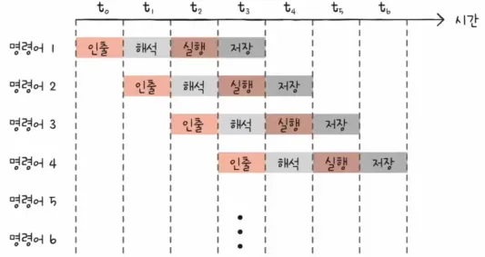

오늘은 강의를 듣고 있다가 Data Race라는 용어를 처음들어봐서 이렇게 정리하게 되었습니다.  
멀티스레딩 환경에서 발생하는 문제입니다.  
일단 이 글에서는 JAVA 기준으로 설명되어 있습니다. :)

## 멀티스레딩 환경에서의 공유자원
Data Race를 이해하기 위해서는 먼저 멀티스레딩 환경에서 어떤 부분을 공유하고 있는지를 알고 있어야 합니다.  
일단 메모리에 있는 Heap영역에 할당된 자원들은 모두 멀티스레딩 환경에서 공유됩니다.
- 객체들
- Class 멤버 변수
- Static 변수
위와 같은 요소들이 공유자원이 됩니다.

## 비순차적 명령어 처리
비순차적 명령어 처리가 Data Race에 원인이 되므로 이것도 먼저 알아봅시다.

먼저 비순차적 명령어 처리는 명령어 파이프라인에서 발생하므로 명령어 파이프라인부터 알아봅시다.

CPU는 병렬적으로 명령어를 실행하는 명령어 파이프라인을 사용합니다.
명령어 파이프라인을 사용하지 않았을 때 아래와 같이 실행시간이 매우 길어지기 때문입니다. 


<div class="source">[혼공운체] 명령어 파이프라인 사용 X</div>

명령어 파이프라인을 사용하면 아래와 같이 빠르게 실행할 수 있게 됩니다.


<div class="source">[혼공운체] 명령어 파이프라인 사용 O</div>

<mark>비순차적 명령어 처리</mark>는 명령어 파이프라인에서 사용되는 명령어 병렬처리 기법입니다.
먼저 예시를 보며 이해를 돕겠습니다.  

예를들어 아래와 같은 명령어들로 이루어진 소스 코드가 있다고 해봅시다.


위는 명령어 처리할 때 3번의 명령어가 1번, 2번 명령어에 의존하고 있기 때문에 3번 명령어를 처리하기 위해 나머지 4, 5, 6 명령어들이 기다리고 있게 됩니다.

그래서 CPU는 효율적으로 처리하기 위해 아래와 같이 명령어의 순서를 바꿉니다.


이렇게 되면 4, 5, 6 명령어는 기다리지 않고, 바로 실행할 수 있게 됩니다.

아무 명령어나 순서를 바꾸지는 않고, 코드의 의존성으로 문제가 되지 않을 때만 변경합니다.
## Data Race
<mark>Data Race란 </mark> 여러 프로세스/스레드가 공유된 데이터를 읽고 쓰는 작업을 할 때 실행 순서에 따라서 잘못된 값을 읽거나 쓰게 되는 상황입니다.

### Data Race가 발생하는 상황
말로만 들으면 이해가 잘 되지 않으니 코드 예시를 보면서 Data Race가 발생하는 상황을 봅시다.


```java
public static class SharedClass {
        private int x = 0; // 공유 자원
        private int y = 0; // 공유 자원

        // Thread1
        public void increment() {
            x++;
            y++;
        }

        // Thread2
        public void checkForDataRace() {
            if (y > x) {
                System.out.println("y > x - 데이터 레이스가 감지됨!!");
            }
        }
    }
```
클래스 멤버 변수는 공유 자원으로 여기서 x, y는 공유 자원이 됩니다. 그리고 increment 메서드와 checkForDataRace 메서드는 각각의 스레드로 병렬적으로 실행하게 만들겁니다.

여기서 이제 메서드들을 한 번 살펴보면 여러 경우로 결과가 나눠지는 경우가 있습니다.


순차적으로 실행되면 당연히 `Y > X`보다 큰 경우는 없고, `X == Y`라는 결과만 갖게 됩니다.

---

다른 경우가 또 있습니다. 예를 들어, increment를 실행하는 도중에 checkForDataRace 메서드의 조건문이 실행되는 것이죠. 멀티스레딩 환경이기 때문에 병렬적으로 실행이 이루어져 이런 상황도 있습니다.


이 경우에는 X만 1증가한 상태라서 `Y < X`가 된 상태인거죠.  
그래서 checkForDataRace 메서드의 `Y > X`는 만족하지 않습니다.

그러면 어떠한 경우에도 `Y > X`는 만족하지 않아서 절대 `System.out.println("y > x - 데이터 레이스가 감지됨!!");`는 실행되어야 하지 않습니다.

그러면 한 번 실행을 시켜보겠습니다.
```java
public class DataRaceProblem {
    public static void main(String[] args) {
        SharedClass sharedClass = new SharedClass();

        Thread thread1 = new Thread(() -> {
            for (int i = 0; i < Integer.MAX_VALUE; i++) {
                sharedClass.increment();
            }
        } ); // increment Thread

        Thread thread2 = new Thread(() -> {
            for (int i = 0; i < Integer.MAX_VALUE; i++) {
                sharedClass.checkForDataRace();
            }
        } ); // checkForDataRace Thread

        thread1.start();
        thread2.start();
    }

    public static class SharedClass {
        private int x = 0;
        private int y = 0;

        public void increment() {
            x++;
            y++;
        }

        public void checkForDataRace() {
            if (y > x) {
                System.out.println("y > x - 데이터 레이스가 감지됨!!");
            }
        }
    }
}
```
```java
y > x - 데이터 레이스가 감지됨!!
y > x - 데이터 레이스가 감지됨!!
```
실행할 때마다 결과는 달라지긴 하지만 결과를 보면 `Y > X`를 만족하는 경우가 있다는 것입니다. 

어떻게 이런 결과가 나올 수 있을까요?  
그 이유는 바로 <mark>비순차적 명령어 처리</mark>때문입니다.  
increment메서드의 내용을 한 번 다시 봅시다.
```java
public void increment() {
    x++;
    y++;
}
```
increment메서드의 안에 x++, y++은 서로 의존적이지 않습니다. 그래서 컴파일러 최적화 과정에서 비순차적 명령어 처리가 충분히 일어날 수 있는 부분입니다. <mark>그래서 x++, y++ 순서대로 처리가 되는 것이 아닌 비순차적 처리 때문에 y++, x++로 처리가 되는 경우가 있어 Data Race가 발생하게 됩니다.</mark>


## Data Race 해결 방법
Data Race의 해결 방법에는 두 가지가 있습니다.
<details><summary><mark>메서드에 Synchroized 키워드 사용하기</mark></summary>

- 한 번에 하나의 스레드만이 블록 또는 메서드에 진입할 수 있도록 보장합니다.
- 임계 영역에 진입하는 스레드는 다른 스레드가 해당 블록 또는 메서드에 접근하지 못하게 합니다.
- 락을 사용하여 동기화를 구현하므로 상대적으로 무겁고 오버헤드가 큽니다.
- 코드 블록이나 메서드 내에서 사용되며, 메서드에 적용할 경우 전체 메서드가 동기화됩니다.
    ```java
      public synchronized void synchronizedMethod() {
    // 동기화된 메서드 내용
    }

    ```
</details>
<br>
<details><summary><mark>변수에 Volatile 키워드 사용하기</mark></summary>

- 변수를 메모리에서 읽거나 쓸 때 항상 메인 메모리를 참조하도록 보장합니다.
- 캐시된 값 사용을 방지하여 변수의 일관성을 제공합니다.
- volatile 키워드를 사용한 변수는 원자적으로 읽기 및 쓰기 연산이 수행됩니다.
- 단순한 변수의 상태를 보장하며, 복합 연산에 대해서는 synchronized가 더 적합합니다.
- 비순차적 명령어 처리하는 경우,  
    volatile 변수에 대한 쓰기 명령 이전의 명령들은 reordering 이후에도 volatile 변수에 대한 쓰기 명령 이전에 실행되도록 유지됩니다.  
    volatile 변수에 대한 읽기 명령 이후의 명령들은 reordeing 이후에도 volatile 변수에 대한 읽기 명령 이후에 실행되도록 유지합니다.  
    -> 즉, 비순차적 명령어 처리가 발생하지 않는 것을 의미합니다. 

<div class="code-header">
   <span class="red btn"></span>
   <span class="yellow btn"></span>
   <span class="green btn"></span>
</div>

```java
volatile int sharedVal;
public void method() {
  .... // volatile 명령어 이전에 있는 명령어들은 volatile 명령어 접근 전에 실행되도록 보장
  read/write(sharedVal);
  ... // volatile 명령어 이후에 있는 명령어들은 volatile 명령어 접근 후에 실행되도록 보장
}

```
</details>

---

여기서는 두 개의 스레드로 한 메서드를 실행하는 Race Condition이 아니므로 두 메서드에 Synchronize 키워드로 동시 실행을 막지 않아도 됩니다. 그래서 Lock를 덜 잡는 Volatile를 사용해서 Data Race를 해결해보겠습니다.
```java

  public static class SharedClass {
      private volatile int x = 0; // 변경된 부분
      private volatile int y = 0; // 변경된 부분

      public void increment() {
          x++;
          y++;
      }

      public void checkForDataRace() {
          if (y > x) {
              System.out.println("y > x - 데이터 레이스가 감지됨!!");
          }
      }
  }
```

이렇게 하면 `y > x`조건을 만족하지 못해`System.out.println("y > x - 데이터 레이스가 감지됨!!");`을 실행하지 않습니다.

## 정리
정리하자면, Data Race가 발생하는 이유는 CPU를 효율적으로 활용하기 위해 사용하고 있는 비순차적 명령어 처리가 이유입니다.
이러한 Data Race를 해결하기 위해서는 Synchronized, Volatile을 적용할 수 있습니다.

참고한 사이트  
Volatile : [말랑님 블로그](https://ttl-blog.tistory.com/238)  
Data Race : [Udemy 강의](https://www.udemy.com/course/java-multi-threading/)  
명령어 파이프라인 : 혼자 공부하는 컴퓨터 구조 및 운영체제
