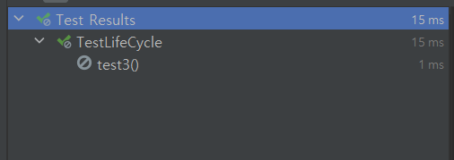

## 테스트 코드의 필요성을 느꼈을 때
회사에서 개발을 하고 있다가 기존 기획과 달라지는 부분이 있어서 기능을 다시 새롭게 만들어야 하는 부분이 있었습니다. 이렇게 수정하면서 리팩토링도 같이 진행을 했었는데 변경된 수정 사항이 엣지 케이스에 동작을 하지 않고 오류가 발생하는 경우가 발생했습니다!  
앞으로는 이러한 일이 더 빈번하게 일어날텐데 어떻게 해야할까 고민하던 중에 예전에 리팩토링 책을 읽었을 때 리팩토링을 할 때는 언제나 테스트 코드가 존재해야한다고 들었던 것이 기억이 났습니다.


## 우리는 왜 테스트 코드를 작성하는가?
바로 이러한 장점들이 있기 때문!! 

1. **품질 확인**: 테스트 코드는 소프트웨어의 기능이 예상대로 작동하는지 확인하게 해줍니다. 이를 통해 개발자는 버그나 예상치 못한 동작을 빠르게 발견하고 수정할 수 있습니다.
2. **회귀 테스트**: 테스트 코드는 새로운 기능을 추가하거나 기존 코드를 변경했을 때 이전에 작동하던 기능이 여전히 잘 작동하는지 확인하는 데 도움이 됩니다. 이를 회귀 테스트라고 하며, 테스트 코드가 없다면 이러한 테스트를 수동으로 수행해야 할 수도 있습니다.
3. **리팩토링**: 코드베이스를 정리하거나 개선하는 작업을 리팩토링이라고 합니다. 테스트 코드는 개발자가 리팩토링하는 동안 기능이 여전히 올바르게 작동하는지 확인하는 데 도움이 됩니다.
4. **문서화**: 테스트 코드는 종종 코드의 사용법을 설명하는 데 사용됩니다. 개발자가 어떻게 API를 사용해야 하는지 또는 특정 기능이 어떻게 동작하는지 이해하려면 테스트 코드를 읽을 수 있습니다.
5. **신뢰성**: 테스트 코드는 사용자와 다른 개발자에게 소프트웨어의 신뢰성을 보여주는 좋은 방법입니다. 테스트 커버리지가 높을수록 코드의 신뢰성이 높다고 간주되며, 이는 개발자와 사용자 모두에게 중요한 특성입니다.
6. **개발 속도 증가**: 처음에는 테스트 코드를 작성하는 데 시간이 들 수 있지만, 장기적으로 보면 개발 과정을 가속화할 수 있습니다. 테스트 코드를 통해 빠르게 버그를 발견하고 수정할 수 있으며, 코드 변경의 영향을 쉽게 이해할 수 있습니다.

이러한 이유들로 인해 많은 개발자와 조직들이 테스트 코드 작성을 중요하게 여기며, 테스트 주도 개발(TDD)과 같은 방법론을 따르기도 합니다.

## 테스트를 작성할 때 꼭 TDD는 해야할까?
언제나 테스트 코드를 작성할 때면 테스트 주도 개발(TDD:Test Driven Development)가 따라오고는 합니다..! 과연 TDD는 꼭 해야하는 걸까요?  

테스트 주도 개발(TDD)는 소프트웨어 개발의 하나로, 테스트를 먼저 작성하고 그 테스트를 통과하는 코드를 작성하는 방법을 가르킵니다. 이는 테스트의 중요성을 강조하며, 테스트가 요구 사항의 정의와 동시에 품질을 보장하는 역할을 수행한다는 것을 나타냅니다.

그러나 <mark>TDD가 항상 적절한 것은 아닙니다. TDD의 적용 여부는 여러 요인에 따라 달라집니다!</mark>

1. **프로젝트의 복잡성**: 복잡한 프로젝트에서는 TDD가 매우 유용할 수 있습니다. 테스트를 먼저 작성함으로써 요구 사항을 명확히 이해하고, 코드의 구조와 설계를 개선하며, 향후 버그를 줄일 수 있습니다.
2. **프로젝트의 수명**: 장기 프로젝트에서는 TDD가 유용합니다. 코드 변경에 따른 회귀 테스트를 자동화하고, 리팩토링을 용이하게 하며, 코드베이스의 유지 보수를 돕습니다.
3. **팀의 경험**: TDD는 적절히 수행하려면 경험이 필요합니다. 팀원들이 TDD에 익숙하지 않다면, 이를 배우고 적용하는데 시간이 필요하며 이로 인해 초기 개발 속도가 느려질 수 있습니다.
4. **프로토타입 개발**: 빠르게 프로토타입을 만들어야 하는 경우에는 TDD가 항상 가장 좋은 방법이 아닐 수 있습니다. 이러한 경우에는 프로토타입이 만족스러운 결과를 보일 때까지 빠르게 반복하는 것이 중요하며, 이후에 안정된 버전을 개발하는 동안 TDD를 적용할 수 있습니다.

이처럼 TDD는 유용한 도구이지만, 항상 적용해야 하는 것은 아닙니다. 프로젝트의 특성과 요구 사항, 팀의 경험 등을 고려하여 TDD가 적절한지를 판단해야 합니다.

## 코틀린 스프링부트 라이브러리 
스프링 부트에서 Kotlin을 사용하여 테스트를 작성할 때 주로 사용하는 테스트 라이브러리는 **JUnit**, **Mockito**, 그리고 **Spring Boot Test**입니다. 이 라이브러리들을 사용하면 단위 테스트, 통합 테스트, 그리고 애플리케이션의 전체 라이프사이클을 테스트 할 수 있습니다.  
먼저 JUnit부터 간단히 알아봅시다!

### JUnit
Java 진영의 대표적인 Test Framework  
단위 테스트(Unit Test)를 위한 도구를 제공합니다.
- 단위 테스트란?   
  - 코드의 특정 모듈이 의도된대로 동작하는지 테스트하는 절차를 의미합니다.  
  - 모든 함수와 메소드에 대한 각각의 테스트 케이스를 작성하는 것입니다.
어노테이션을 기반으로 테스트를 지원합니다.  
단정문(Assert)으로 테스트 케이스의 기대값에 대해 수행 결과를 확인할 수 있습니다.  
JUnit5는 Spring Boot 2.2버전부터 사용합니다.  
JUnit5는 Jupiter, Platform, Vintage 모듈로 구성됩니다.

#### JUnit LifeCycle Annotation
JUnit5는 아래와 같은 테스트 라이프 사이클을 가지고 있습니다.
|Annotation|Description|
|---|---|
|@Test|테스트용 메소드를 표현하는 어노테이션|
|@BeforeEach|각 테스트 메소드가 시작되기 전에 실행되어야 하는 메소드를 표현|
|@AfterEach|각 테스트 메소드가 시작된 후 실행되어야 하는 메소드를 표현|
|@BeforeAll|테스트 시작 전에 실행되어야 하는 메소드를 표현 (static 처리 필요)|
|@AfterAll|테스트 종료 후에 실행되어야 하는 메소드를 표현 (static 처리 필요)|

#### 예시 코드
<div class="code-header">
	<span class="red btn"></span>
	<span class="yellow btn"></span>
	<span class="green btn"></span>
</div>


```kotlin
package com.example.Test

import org.junit.jupiter.api.*
import org.springframework.boot.test.context.SpringBootTest

class TestLifeCycle {
	@BeforeEach
	fun beforeEach() {
		println("## beforeEach 호출")
		println()
	}

	@AfterEach
	fun afterEach() {
		println("## afterEach 호출")
		println()
	}

	@Test
	fun test1() {
		println("## test1 시작")
		println()
	}

	@Test
	@DisplayName("Test 2")
	fun test2() {
		println("## test2 시작")
		println()
	}

	@Test
	@Disabled
	 // Disabled Annotation : 테스트를 실행하지 않게 설정하는 어노테이션
	fun test3() {
		println("## test3 시작")
		println()
	}

	companion object {
		@BeforeAll
		@JvmStatic // 코틀린에서 BeforeAll을 사용하려면 이 어노테이션을!
		fun beforeAll() {
			println("## BeforeAll호출 ")
			println()
		}

		@AfterAll
		@JvmStatic
		fun afterAll() {
			println("## afterAll 호출")
			println()
		}
	}
}
```
#### 출력 결과
```python
## BeforeAll호출 

## beforeEach 호출

## test1 시작

## afterEach 호출

## beforeEach 호출

## test2 시작

## afterEach 호출

## afterAll 호출
```

테스트 3는 Disable Annotation 때문에 실행이 되지 않았습니다!

## 좋은 테스트를 위한 이론!
본격적으로 테스트를 하기 전에 우리는 먼저 알아야되는 것들이 있습니다.  
예를들어, BDD라던가 FIRST라던가.. 말이죠!  
이를 먼저 이해하는 것이 좋은 테스트를 작성할 때 도움이 될 겁니다!

### BDD(Behavior Driven Development, 행위주도개발)
BDD란 행위 주도 개발입니다!
- BDD는 TDD를 근간으로 파생된 개발 방법입니다.
- TDD에서 한발 더 나아가 테스트 케이스 자체가 요구사항이 되도록 하는 개발 방법입니다.
- 개발자, 테스터 및 비즈니스 이해 관계자 간의 의사 소통을 강화하고, 기능의 동작과 예상 결과를 예측 가능하게 만듭니다. 
- 테스트 주도 개발(Test-Driven Development, TDD) 및 도메인 주도 설계(Domain-Driven Design, DDD)과 같은 다른 개발 방법론과도 잘 조합될 수 있습니다. 

#### BDD 패턴 및 요소
1. 스토리 (Story): BDD에서는 비즈니스 요구사항을 "스토리"로 표현합니다. 이는 사용자의 관점에서 소프트웨어 기능에 대한 설명이며, 주어진 상황에서 어떤 행동이 기대되는지를 나타냅니다.

2. 시나리오 (Scenario): 각 스토리에는 하나 이상의 시나리오가 포함됩니다. 시나리오는 특정한 상황에서 소프트웨어의 기능과 행위에 대한 구체적인 예시를 제시합니다.

3. Given-When-Then 구조: BDD에서 시나리오는 "Given-When-Then" 구조로 작성됩니다. 이 구조는 다음과 같이 세 가지 부분으로 나뉩니다   
   Given: 테스트 환경의 초기 상태를 설정합니다.   
   When: 사용자의 특정한 행동이 발생했을 때를 정의합니다.   
   Then: 예상되는 결과를 기술합니다.   


<div class="code-header">
	<span class="red btn"></span>
	<span class="yellow btn"></span>
	<span class="green btn"></span>
</div>

```kotlin
@Test
fun `BDD behavior driven development`() {
    // given
    given(calculatorService.add(20.0, 10.0)).willReturn(30.0)

    // when
    val result = calculatorService.add(20.0, 10.0)

    // then
    Assert.assertThat(30.0, CoreMatchers.`is`(result))
}
```

### FIRST
FIRST는 소프트웨어 테스트를 효과적으로 설계하고 구성하기 위한 가이드라인을 제공하는 약어입니다. FIRST는 "Fast, Independent, Repeatable, Self-validating, Timely"의 첫 글자로 구성됩니다. 각각의 원칙은 다음과 같은 의미를 가지고 있습니다..!

1. <mark>Fast (빠르게)</mark>: 테스트는 빠르게 실행되어야 합니다. 테스트가 느리게 실행되면 개발자들이 테스트를 자주 실행하지 않을 수 있으며, 이는 버그를 빠르게 식별하고 수정하기 어렵게 만들 수 있습니다. 빠른 테스트는 빠른 피드백과 빠른 개발을 가능하게 합니다.
2. <mark>Independent (독립적으로)</mark>: 각 테스트는 다른 테스트와 독립적으로 실행되어야 합니다. 한 테스트가 다른 테스트에 의존하면 테스트 간에 상호작용이 생기고, 테스트를 이해하고 유지 관리하기가 어려워집니다. 독립적인 테스트는 테스트의 신뢰성을 높이고, 수정 및 재구성이 용이하게 만듭니다.
3. <mark>Repeatable (반복 가능하게)</mark>: 테스트는 어떤 환경에서도 반복 가능해야 합니다. 테스트가 실행될 때마다 동일한 결과가 나와야 하며, 외부 요소에 의해 영향을 받지 않아야 합니다. 반복 가능한 테스트는 버그를 신속하게 재현하고, 테스트 환경을 변경할 때도 안정적으로 동작합니다.
4. <mark>Self-validating (자체 검증 가능하게)</mark>: 테스트는 자동으로 판단 가능해야 합니다. 테스트가 수동으로 실행되거나 개발자의 주관에 의존하는 것은 신뢰성과 일관성을 저하시킬 수 있습니다. 자체 검증 가능한 테스트는 예상된 결과를 자동으로 확인하고 판단합니다.
5. <mark>Timely (적시에)</mark>: 테스트는 적시에 작성되어야 합니다. 테스트는 개발 과정의 초기부터 작성되어야 하며, 개발과 함께 진행되어야 합니다. 테스트를 미루면 버그를 발견하고 수정하는 데 더 많은 비용과 시간이 소요될 수 있습니다.

FIRST 원칙을 따르는 테스트는 신뢰성이 높고 유지 보수가 쉬우며, 효과적인 소프트웨어 개발을 지원합니다. 이러한 원칙을 따르면 테스트의 품질과 가치를 높일 수 있습니다.

### Right-BICEP
"RIGHT-BICEP"는 소프트웨어 테스트를 설계하는 데 사용되는 기법 중 하나입니다. 이 기법은 테스트 케이스를 작성하고 실행할 때 고려해야 할 다양한 요소를 나타내는 약어입니다. 각 알파벳은 다음과 같은 의미를 가지고 있습니다!!

1. Right: 올바른 결과를 얻는지 확인합니다. 이는 소프트웨어가 예상대로 동작하고 정확한 출력을 생성하는지 확인하는 것을 의미합니다.
2. BICEP:
   - <mark>Boundary conditions (경계 조건)</mark>: 입력 데이터의 경계 값을 테스트하여 소프트웨어가 경계 조건에서 올바르게 작동하는지 확인합니다. 이는 최소값, 최대값, 경계값 등과 같이 입력 범위의 경계에 해당하는 값을 테스트하는 것을 의미합니다.
   - <mark>Incorrect values (잘못된 값)</mark>: 잘못된 또는 부적절한 값으로 소프트웨어를 테스트하여 예외 상황이나 오류 처리 기능을 확인합니다.
   - <mark>Inverse relationships (역 관계)</mark>: 입력 값 사이의 역 관계를 테스트하여 소프트웨어가 정확한 상호 작용을 수행하는지 확인합니다. 예를 들어, A와 B라는 입력 값이 서로 역 관계에 있을 때, A를 변경하면 B에도 적절한 변화가 있는지 테스트합니다.
   - <mark>Cross-check results (결과 교차 확인)</mark>: 소프트웨어의 다른 부분 또는 동일한 기능의 대안 구현을 사용하여 결과를 교차 확인합니다. 이를 통해 독립적인 구현 간의 결과 일치성을 검증할 수 있습니다.
   - <mark>Performance characteristics (성능 특성)</mark>: 소프트웨어의 성능 요구사항에 맞게 테스트를 수행하여 응답 시간, 처리량, 자원 사용 등과 같은 성능 특성을 확인합니다.

RIGHT-BICEP 기법을 사용하면 다양한 시나리오와 테스트 케이스를 고려하여 소프트웨어를 더 철저하게 테스트할 수 있습니다. 이를 통해 소프트웨어의 정확성, 예외 처리, 상호 작용, 일관성, 성능 등을 평가하고 개선할 수 있습니다.

### CORRECT
테스트 이론 중 "CORRECT"는 소프트웨어 테스트를 계획하고 수행하는 데 도움이 되는 가이드라인을 제공하는 메모 기법입니다. 이 기법은 테스트 케이스를 작성하고 검증할 때 고려해야 할 다양한 요소를 나타냅니다. "CORRECT"는 다음과 같은 의미를 가지는 약어입니다

1. <mark>Conformance (일치)</mark>: 소프트웨어가 요구사항과 규격에 따라 정확하게 동작하는지 확인합니다. 이는 소프트웨어가 정확한 입력에 대해 올바른 결과를 생성하는지를 평가합니다.
2. <mark>Ordering (순서)</mark>: 소프트웨어의 동작이 올바른 순서로 이루어지는지 확인합니다. 이는 시간, 우선순위, 종속성 등과 같은 다양한 상황에서 소프트웨어가 예상된 순서로 동작하는지를 테스트합니다.
3. <mark>Range (범위)</mark>: 소프트웨어가 허용된 범위 내에서 정확한 결과를 생성하는지 확인합니다. 이는 입력값의 범위, 데이터 타입의 제약 등과 같은 다양한 조건에서 소프트웨어가 올바른 동작을 수행하는지를 평가합니다.
4. <mark>Reference (참조)</mark>: 소프트웨어의 동작이 외부 참조나 연관된 구성 요소와 일치하는지 확인합니다. 이는 외부 라이브러리, API, 데이터베이스 등과 같은 참조 요소와의 상호작용을 테스트하여 예상된 동작을 수행하는지를 평가합니다.
5. <mark>Errors (오류)</mark>: 소프트웨어의 오류 처리 기능을 평가합니다. 이는 잘못된 입력, 예외 상황, 예측할 수 없는 상황 등에 대한 소프트웨어의 오류 처리 능력을 확인하는 것을 의미합니다.
6. <mark>Combinations (조합)</mark>: 다양한 입력 값의 조합에 대해 소프트웨어가 예상된 동작을 수행하는지 확인합니다. 이는 입력값의 조합이 다양한 경우에 대한 테스트를 수행하여 소프트웨어의 동작을 검증하는 것을 의미합니다.
7. <mark>Tests (테스트)</mark>: 모든 테스트 케이스가 적절하게 작성되어 소프트웨어를 충분히 커버하는지 확인합니다. 이는 테스트 커버리지를 확인하고 빠뜨린 테스트 케이스가 없는지를 평가합니다.

CORRECT 기법은 테스트의 완전성과 정확성을 높이기 위해 다양한 측면을 고려하여 테스트를 계획하고 수행하는 데 도움을 줍니다. 이를 통해 소프트웨어의 신뢰성과 품질을 향상시킬 수 있습니다.