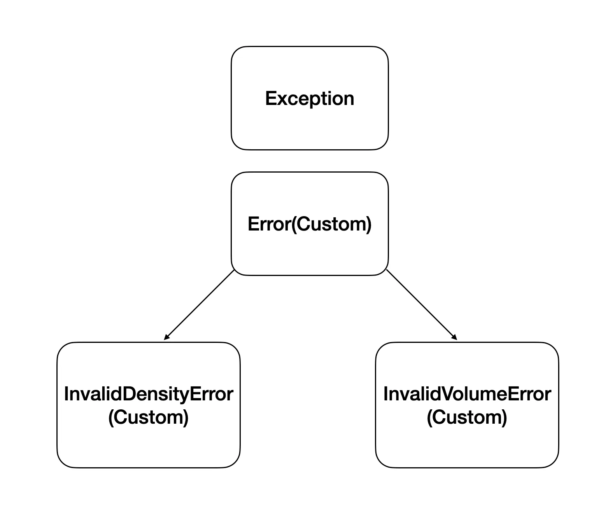

## 들어가기 전
이전에 도커로 웹 크롤링을 도커 위에서 하나의 사이트마다 24시간 동안 돌리기 위해 크롤링 구조를 새로 짠 적이 있습니다. 그 때에 예외 처리는 어떻게 하는 것이 좋을까라는 생각을 많이 했었습니다.  
크롤링 같은 경우 에러가 발생한 경우 그 에러 상황을 재현하기가 쉽지 않을 때가 존재합니다..! 해당 URL의 게시물이 사라진 경우.. 또한, 어디에서 에러가 발생했는지 쉽지 않습니다.  
그래서 이번에는 예외 처리를 훌륭하게 해보려고 시도했습니다. 그래도 이번에 이렇게 책에서 나온것처럼 처리한 것 같아서 다행입니다..!  
다른 분들도 파이썬에서 예외처리를 잘하고 싶다면 이번에 나오는 예제를 잘 참고해보시는 것이 좋을 듯 합니다!! 
 
이번 글은 [파이썬 코딩의 기술](https://product.kyobobook.co.kr/detail/S000001834494)을 보고 참조 + 저의 생각을 합쳐서 나온 게시글입니다.  
만약 저작권의 문제 발생하거나 잘못된 부분이 있는 경우, 글을 삭제/수정처리 하도록 하겠습니다!


## ❌ 함수에서 예외가 발생했을 때 None을 반환하는 것의 문제점!
갑자기 이게 무슨 이야기인지 싶으실 겁니다.  
바로 아래 예제를 확인하시면 이해가 더 잘 되실 겁니다.
<div class="code-header">
	<span class="red btn"></span>
	<span class="yellow btn"></span>
	<span class="green btn"></span>
</div>

```python
def careful_divide(a, b):
    try:
        return a / b
    except ZeroDivisionError:
        return None


x, y = 1, 0
result = careful_divide(x, y)
if result is None:
    print('잘못된 입력')
```
함수에서 예외가 발생했을 때 예외 처리로 None을 리턴하는 방식이 있다고 합니다.  
보통 코드를 이렇게 쓰지는 않긴 합니다만..! 만약 None으로 쓰고계셨다면 이제 쓰지 않으시는 걸 추천합니다!  
그 이유는 바로 현재 함수를 호출하고 있는 호출자에서 if 조건에서 따로 처리를 해주고 있는 모습으로 보입니다.  
그런데 이렇게 처리하는 방법은 실수가 유발되기 쉽습니다.

<div class="code-header">
	<span class="red btn"></span>
	<span class="yellow btn"></span>
	<span class="green btn"></span>
</div>

```python
#
x, y = 0, 5
result = careful_divide(x, y)
if not result:
    print('잘못된 입력') # 이 코드가 실행되는데, 사실 이 코드가 실행되면 안된다!
```
이 코드에서는 result 값이 0으로 반환받게 됩니다.  
이렇게 되면 if문 안의 결과가 False로 되어 print를 실행하게 됩니다. 다른 함수와 같은 경우에도 비슷합니다. False를 반환하는 값이라면 이와 같은 실수가 발생할 수 있게 되는거죠.

그러면 어떻게 해야 예외를 잘 처리할 수 있을까요?

## ✅ Exception에서 다시 한 번 예외를 발생시켜 호출한 쪽에서 처리하기
말 그대로 함수에서 예외를 처리를 한 번 하고, 다시 한 번 예외를 발생시켜 처리하는 방법입니다.

<div class="code-header">
	<span class="red btn"></span>
	<span class="yellow btn"></span>
	<span class="green btn"></span>
</div>

```python
def careful_divide(a: float, b: float) -> float:
    """a를 b로 나눈다.

    Raises:
        ValueError: b가 0이어서 나눗셈을 할 수 없을 때
    """
    try:
        return a / b
    except ZeroDivisionError as e:
        raise ValueError('잘못된 입력')


x, y = 5, 2
try:
    result = careful_divide(x, y)
except ValueError:
    print('잘못된 입력')
else:
    print('결과는 %.1f 입니다' % result)
```
이렇게 하면 기존의 None은 반환했을 때와 달리 if문 자체를 쓰지 않아도 돼서 실수를 없앨 수 있습니다.

근데 이제 굳이 이렇게까지 try-except를 두 번씩 쓰면서 함수의 Main부분에서 예외처리를 할 필요가 있을까라는 생각이 들게 됩니다..!
~~저도 처음에 불편해서 했던 생각..~~

코드의 Main 함수에서 예외처리를 하는 것을 최상위 예외라고 합니다. 
그러면 최상위 예외를 왜 쓰면 좋은지를 알아보기 전에 커스텀한 예외를 써야하는 이유에 대해서 알아보겠습니다!
~~그래야 예제가 이해가 되고.. 또.. 예외를 더 잘할 수 있다구요!~~

## 새로운 예외 계층 구조를 정의하는 것이 좋은 이유
파이썬 언어와 표준 라이브러리에는 이미 예외 계층 구조가 내장되어 있습니다.


<div class="code-header">
	<span class="red btn"></span>
	<span class="yellow btn"></span>
	<span class="green btn"></span>
</div>

```python
# my_module.py
def determine_weight(volume, density):
    if density <= 0:
        raise ValueError('밀도는 0보다 커야 합니다') # 내장된 예외
    ...
```
경우에 따라 내장된 예외인 ValueError를 사용하는 편이 타당할 때도 있습니다.  
하지만, API의 경우 새로운 예외 계층 구조를 정의하는 편이 훨씬 강력합니다.  
모듈에 최상위 Exception을 정의하고 모듈이 발생시키는 다른 모든 예가 이 최상위 예외를 상속하게 만듦으로써 API에서 발생하는 예외의 계층 구조를 만들 수 있습니다.
<div class="code-header">
	<span class="red btn"></span>
	<span class="yellow btn"></span>
	<span class="green btn"></span>
</div>

```python
# my_module.py
class Error(Exception):
    """이 모듈에서 발생할 모든 예외의 상위 클래스."""


class InvalidDensityError(Error):
    """밀도 값이 잘못된 경우."""


class InvalidVolumeError(Error):
    """부피 값이 잘못된 경우."""


def determine_weight(volume, density):
    if density < 0:
        raise InvalidDensityError('밀도는 0보다 커야 합니다')
    if volume < 0:
        raise InvalidVolumeError('부피는 0보다 커야 합니다')
    if volume == 0:
        density / volume
```
이번에는 이렇게 새로운 예외 계층을 정의하면 어떤 점이 좋은지 알아보겠습니다.

### ✅ 새로운 예외 계층을 정의하면 API를 잘못 사용한 경우를 더 쉽게 이해할 수 있습니다.
<div class="code-header">
	<span class="red btn"></span>
	<span class="yellow btn"></span>
	<span class="green btn"></span>
</div>

```python
try:
    # 호출 코드 버그로 인한 오류가 나야 함
    weight = my_module.determine_weight(-1, 1)
except my_module.InvalidDensityError:
    weight = 0
except Exception: 
    logging.exception('호출 코드에 버그가 있음')

>> ERROR:root:호출 코드에 버그가 있음
Traceback (most recent call last):
  File "C:\Users\user\PycharmProjects\issueKeyword\test.py", line 27, in <module>
    weight = determine_weight(-1, 1)
  File "C:\Users\user\PycharmProjects\issueKeyword\test.py", line 18, in determine_weight
    raise InvalidVolumeError('부피는 0보다 커야 합니다')
InvalidVolumeError: 부피는 0보다 커야 합니다
```

이렇게 하면 기존에 있었던 InvalidVolumeError를 통해 에러가 발생했구나를 바로 알 수 있고, 에러를 처리하기 쉬워집니다.  

그럼 이제 이렇게 커스텀한 예외 구조 계층을 만들어봤으니 다시 최상위 예외가 있으면 왜 좋은지 알아봅시다!@


## ❓ 최상위 예외와 커스텀한 예외 구조 계층을 쓰면 좋은 점

### ✅ 최상위 예외가 있으면 예상치 못한 예외를 처리가 가능하고, API 코드의 버그를 발견할 때 도움이 됩니다.
<div class="code-header">
	<span class="red btn"></span>
	<span class="yellow btn"></span>
	<span class="green btn"></span>
</div>

```python
def determine_weight(volume, density):
    if density < 0:
        raise InvalidDensityError('밀도는 0보다 커야 합니다')
    if volume < 0:
        raise InvalidVolumeError('부피는 0보다 커야 합니다')
    if volume == 0:
        density / volume

try:
    # 호출 코드 버그로 인한 오류가 나야 함
    weight = my_module.determine_weight(-1, 1)
except my_module.InvalidDensityError:
    weight = 0
except Exception: 
    logging.exception('호출 코드에 버그가 있음')
```
현재 코드의 최상위 부분에서는 InvalidDensityError, 즉 밀도만 따로 weight를 0으로 처리하고 있을 뿐, 따로 부피에 대해서는 예외를 처리해주지 않고 있습니다.  
이럴 때 <mark>라이브러리에 있는 Exception을 사용하면 모든 예외 상황에 대해서 처리해서 프로세스가 종료되지 않게 할 수 있고 로그를 찍어 에러를 쉽게 파악할 수 있습니다.</mark>  
그리고 Exception의 Stack trace를 통해 따로 InvalidVolumeError에 대한 예외 처리를 InvalidDensityError와 같이 weight = 0으로 처리를 따로 해줄 수 있습니다.  

### 제가 사용했던 커스텀한 예외 계층과 최상위 예외
그리고 저 같은 경우에는 따로 제가 만든 예외 계층을 사용하여 어디에서 에러가 발생했는지를 확실하게 알기 위해 각각의 위치에서 제가 만든 다른 예외 계층을 사용했습니다.

제가 사용했던 코드의 예시를 잠깐 드리면..!

<div class="code-header">
	<span class="red btn"></span>
	<span class="yellow btn"></span>
	<span class="green btn"></span>
</div>

```python
def board_page_crawling():
    try:
        ...
    except TimeoutException:
        raise SeleniumError(f'Selenium 크롤링 {url}에서 도중 Timeout 발생')

def Crawling():
    try:
        crawling_list = board_page_crawling()
        insert(crawling_list)
    except SeleniumError:
        logging.exception('Selenium에서 에러 발생')
    except InsertError:
        logging.exception('Insert에서 에러 발생')
    except Exception:
        logging.exception('알 수 없는 오류 발생')
```
이런식으로 사용했었습니다. 이렇게 사용하니 에러 파악이 예전보다 손 쉬워졌고 따로 로그DB를 만들어 컬럼에 Type을 붙여 어떤 함수에서 발생했는지 특정할 수 있었습니다. 그리고 특정 웹사이트 게시물에 대해서 에러가 발생해도 프로세스는 종료되지 않고 크롤링을 이어나갈 수 있었습니다.


## 요약
- 모듈에서 사용할 최상위 예외를 정의하면 API 프로세스를 종료되지 않고 보호할 수 있습니다.
- 자신이 사용하는 예외 계층과 최상위 예외를 같이 사용하면 API 코드의 버그를 쉽게 찾을 수 있습니다.
- 파이썬 Exception을 최상위 예외에 예외 처리를 해준다면 예상치 못한 경우에 대해서도 로그를 남기고 프로세스가 종료되지 않게 할 수 있습니다.
