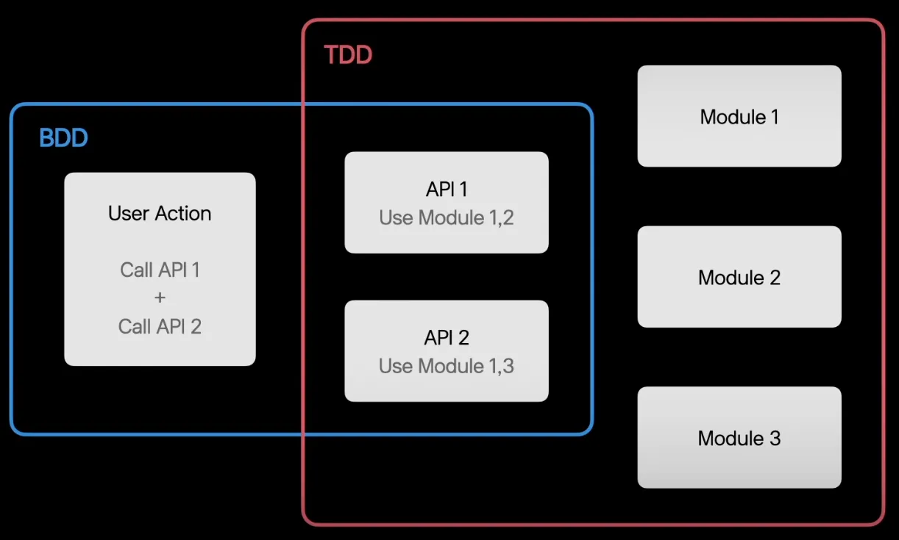
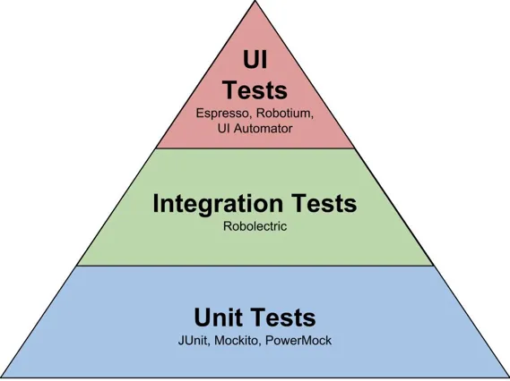

저번에는 테스트를 하는 이유와 좋은 테스트를 하기 위한 조건, 맛보기로 JUnit을 알아보았는데요.   
그래도 역시 제가 생각하기엔 코틀린을 사용하시는 분들이라면 kotest를 사용할 것 같습니다.   
그래서 이번엔 kotest에 대해서 알아보겠습니다.

## TDD, BDD
kotest를 알아보기 앞서 TDD와 BDD의 차이를 알아보겠습니다.   
이 차이를 알아보는 것이 앞으로 테스트를 작성하는데 도움이 될 것이기 때문입니다!

아래는 TDD와 BDD의 주요 차이를 마크다운 표로 정리한 것입니다 : )

|       | TDD (Test-Driven Development) | BDD (Behavior-Driven Development) |
|-------|------------------------------|-----------------------------------|
| 목적  | 코드 품질 향상               | 소프트웨어 동작 및 행위 강조        |
| 중심  | 개발자 중심                   | 동작 중심                         |
| 테스트 | 단위 테스트                   | 기능/행위 테스트                    |
| 테스트 작성 방식 | 코드 기반                     | 자연어 스타일                      |
| 테스트 프레임워크 | 다양한 테스트 프레임워크 선택 가능 | 다양한 BDD 프레임워크 선택 가능      |
| 테스트 구조화 | 테스트 스위트, 테스트 그룹 등으로 구조화 | 시나리오, 스토리 등으로 구조화        |
| 테스트 실행 시점 | 개발 단계 초기에 작성 및 실행   | 요구사항 및 동작 명세 이해 후 작성 및 실행 |
| 대상  | 코드의 동작 검증               | 시스템의 행위 및 기능 검증            |

TDD와 BDD는 접근 방식과 테스트 작성 방법 등에서 차이가 있지만, 상호 보완적인 요소도 많이 가지고 있습니다. 일부 개발자들은 TDD와 BDD를 함께 사용하여 개발하는 경우도 있습니다.

TDD를 했을 때 장점도 분명하지만 아무래도 작성하기 힘들고, 귀찮다는 것이 현실입니다. 그래서 BDD를 사용하면 조금 더 쉽게 테스트를 작성할 수 있습니다.   

BDD로 테스트를 작성하는 것은 기획서를 읽어봤을 때 요구사항을 충족시키는 방향으로 작성하면 돼서 TDD보다 작성하기 수월합니다.   

그래서 실무에서는 이렇게 사용한다고 합니다.



위의 그림과 같이 BDD와 TDD는 상호보완적으로 그려지는데요. 이는 BDD와 TDD를 함께 활용할 수 있음을 의미합니다.


보통은 Integration 테스트에는 BDD를 사용하게 되고 TDD는 유닛테스트에서 사용한다고 합니다.


## Kotest
Kotest는 코틀린(Kotlin) 프로그래밍 언어로 작성된 테스트 프레임워크입니다. 테스트 프레임워크는 개발자가 소프트웨어의 품질을 검증하기 위해 작성하는 테스트 코드를 관리하고 실행하는 데 도움을 주는 도구입니다.

Kotest는 코틀린의 강력한 기능을 활용하여 테스트 코드를 작성하고 실행하는 데 유연성과 간편함을 제공합니다. 다양한 기능을 제공하여 단위 테스트, 통합 테스트, 행위 주도 개발(Behavior-Driven Development, BDD) 스타일의 테스트 등을 지원합니다.

Kotest는 다양한 확장 기능을 제공하여 테스트 환경을 커스터마이징하고 확장할 수 있습니다. 예를 들어, MockK를 사용하여 모의 객체(mock object)를 생성하고 테스트에 활용할 수 있습니다.

Kotest는 개발자 커뮤니티와 지속적으로 발전하고 있으며, 코틀린 생태계에서 인기 있는 테스트 프레임워크 중 하나입니다.

### 간단한 TDD 예제 코드
<div class="code-header">
	<span class="red btn"></span>
	<span class="yellow btn"></span>
	<span class="green btn"></span>
</div>

```kotlin
import io.kotest.core.spec.style.StringSpec
import io.kotest.matchers.shouldBe

class CalculatorTest : StringSpec({

    "더하기 테스트" {
        val calculator = Calculator()
        val result = calculator.add(2, 3)
        result shouldBe 5
    }

    "빼기 테스트" {
        val calculator = Calculator()
        val result = calculator.subtract(5, 3)
        result shouldBe 2
    }
})

class Calculator {
    fun add(a: Int, b: Int): Int {
        return a + b
    }

    fun subtract(a: Int, b: Int): Int {
        return a - b
    }
}

```

위의 코드에서는 `Calculator` 클래스의 `add`와 `subtract` 메서드를 테스트하는 예제입니다. `StringSpec`을 상속받은 테스트 스펙에서 테스트 케이스를 작성하고, `shouldBe` 함수를 사용하여 예상 결과와 실제 결과를 비교합니다.

### 간단한 BDD 예제 코드

```kotlin
import io.kotest.core.spec.style.BehaviorSpec
import io.kotest.matchers.shouldBe

class BankAccountTest : BehaviorSpec({

    given("잔고가 100인 계좌") {
        val bankAccount = BankAccount(100)

        `when`("100을 입금하면") {
            bankAccount.deposit(100)

            then("잔고는 200이어야 한다") {
                bankAccount.balance shouldBe 200
            }
        }

        `when`("50을 출금하면") {
            bankAccount.withdraw(50)

            then("잔고는 50이어야 한다") {
                bankAccount.balance shouldBe 50
            }
        }
    }
})

class BankAccount(initialBalance: Int) {
    var balance: Int = initialBalance

    fun deposit(amount: Int) {
        balance += amount
    }

    fun withdraw(amount: Int) {
        balance -= amount
    }
}
```

위의 코드에서는 `BankAccount` 클래스를 BDD 스타일로 테스트하는 예제입니다. `BehaviorSpec`을 상속받은 테스트 스펙에서 `given`, `when`, `then`을 사용하여 테스트 시나리오를 구조화합니다. 각 시나리오에서 예상 결과와 실제 결과를 `shouldBe` 함수로 비교합니다.

BDD는 Behavior Spec이나 Feature Spec으로 많이 작성합니다.


### 간단한 Spring Web Test
Kotest와 Mockk를 사용하여 Controller, Service, 그리고 Repository 레이어의 테스트 코드를 작성하는 예제입니다. 프레임워크는 Spring Boot를 사용했습니다

아래와 같이 `UserController`, `UserService` 그리고 `UserRepository`의 간단한 코드가 있다고 가정하고 테스트 코드를 작성하겠습니다. 

```kotlin
class User(val id: Int, val name: String)

interface UserRepository {
    fun getUser(id: Int): User?
}

class UserService(private val userRepository: UserRepository) {
    fun getUser(id: Int): User? {
        return userRepository.getUser(id)
    }
}

@RestController
class UserController(private val userService: UserService) {

    @GetMapping("/user/{id}")
    fun getUser(@PathVariable id: Int): ResponseEntity<User> {
        val user = userService.getUser(id) ?: return ResponseEntity.notFound().build()
        return ResponseEntity.ok(user)
    }
}
```

이제 각 레이어에 대한 테스트 코드를 작성해 봅시다.

**UserControllerTest:**
```kotlin
import io.kotest.matchers.shouldBe
import io.mockk.every
import io.mockk.mockk
import org.springframework.http.HttpStatus
import org.springframework.http.ResponseEntity

class UserControllerTest: StringSpec({
    val userService = mockk<UserService>()
    val userController = UserController(userService)

    "만약 유저가 존재한다면 getUser()메서드는 user객체를 반환합니다. " {
        val mockUser = User(id = 1, name = "John Doe")

        every { userService.getUser(1) } returns mockUser

        val response = userController.getUser(1)

        response.statusCode shouldBe HttpStatus.OK
        response.body shouldBe mockUser
    }

    "만약 유저가 존재하지 않다면 getUser() 메서드는 404 에러 메시지를 전달합니다." {
        every { userService.getUser(2) } returns null

        val response = userController.getUser(2)

        response.statusCode shouldBe HttpStatus.NOT_FOUND
    }
})
```

**UserServiceTest:**
```kotlin
class UserServiceTest: StringSpec({
    val userRepository = mockk<UserRepository>()
    val userService = UserService(userRepository)

    "getUser() 메서드는 userId에 맞는 user를 반환해야 합니다." {
        val mockUser = User(id = 1, name = "John Doe")

        every { userRepository.getUser(1) } returns mockUser

        userService.getUser(1) shouldBe mockUser
    }

    "getUser() 메서드는 존재하지 않는 유저에 대해서 null을 반환합니다." {
        every { userRepository.getUser(2) } returns null

        userService.getUser(2) shouldBe null
    }
})
```

**UserRepositoryTest:**
이것은 보통 데이터베이스와 연결되는 객체이므로, 해당 데이터베이스에서 제공하는 테스트 도구나 라이브러리를 사용하는 것이 일반적입니다. Mocking은 이 경우에는 적합하지 않을 수 있습니다.

추가로, 레포지토리 테스트는 데이터베이스의 연결 상태, 쿼리의 정확성 등에 대한 테스트를 주로 담당하므로 mocking이 아닌 실제 데이터베이스 환경에서의 테스트가 필요할 수 있습니다.

### 실제 DB 연결하는 Repository Test
아래는 Spring Boot와 Kotest를 사용하여 `UserRepository`의 테스트를 작성하는 예시입니다!
이번에는 StringSpec이 아닌 FunSpec으로 작성해보겠습니다.

```kotlin
import io.kotest.core.spec.style.FunSpec
import io.kotest.matchers.shouldBe
import org.springframework.beans.factory.annotation.Autowired
import org.springframework.boot.test.autoconfigure.orm.jpa.DataJpaTest
import org.springframework.boot.test.context.SpringBootTest
import org.springframework.test.context.ContextConfiguration

@DataJpaTest
@ContextConfiguration(classes = [Application::class])
class UserRepositoryTest(@Autowired val userRepository: UserRepository): FunSpec({
    test("getUser() 메서드는 userId에 맞는 user를 반환해야 합니다.") {
        val user = User(1, "John Doe") 

        val result = userRepository.getUser(1) // DB에도 User(1, "John Doe")객체가 있다고 가정합니다.
        result shouldBe user
    }

    test("getUser() 메서드는 존재하지 않는 유저에 대해서 null을 반환합니다.") {
        val result = userRepository.getUser(2)
        result shouldBe null
    }
})
```

이 예제에서는 Kotest의 `FunSpec`을 사용하여 테스트를 작성했습니다. `FunSpec`은 각 테스트를 `test` 함수 내부에 작성하며, 이는 각 테스트를 독립적으로 정의할 수 있게 해줍니다. 

또한, Kotest의 matchers 중 하나인 `shouldBe`를 사용하여 테스트 결과를 검증합니다. 이 matcher는 첫 번째 인자가 두 번째 인자와 같아야 함을 의미합니다. 

마지막으로, `@DataJpaTest`와 `@ContextConfiguration` 애노테이션을 사용하여 JPA 관련 설정을 로드하고 `UserRepository` 인터페이스를 통해 데이터베이스와의 상호작용을 테스트합니다.

### 간단한 통합 BDD 통합 테스트
```kotlin
import io.kotest.core.spec.style.BehaviorSpec
import io.kotest.matchers.shouldBe
import org.springframework.beans.factory.annotation.Autowired
import org.springframework.boot.test.autoconfigure.orm.jpa.DataJpaTest
import org.springframework.boot.test.autoconfigure.web.servlet.AutoConfigureMockMvc
import org.springframework.boot.test.context.SpringBootTest
import org.springframework.http.HttpStatus
import org.springframework.test.web.servlet.MockMvc
import org.springframework.test.web.servlet.request.MockMvcRequestBuilders.get
import org.springframework.test.web.servlet.result.MockMvcResultMatchers.status

@SpringBootTest
@AutoConfigureMockMvc
class UserControllerIntegrationTest(@Autowired val mockMvc: MockMvc) : BehaviorSpec({

    Given("UserController's `/user/{id}` endpoint") {
        When("유저가 존재할 때") {
            val user = User(1, "John Doe") // DB에 있다고 가정합니다!

            Then("UserId에 해당하는 유저를 반환합니다.") {
                val result = mockMvc.perform(get("/user/1"))
                    .andExpect(status().isOk)
                    .andReturn()

                val responseBody = result.response.contentAsString
                responseBody shouldBe "{\"id\":1,\"name\":\"John Doe\"}"
            }
        }

        When("유저가 존재하지 않을때") {
            Then("404 상태코드를 보냅니다.") {
                val result = mockMvc.perform(get("/user/2"))
                    .andExpect(status().isNotFound)
                    .andReturn()

                result.response.status shouldBe HttpStatus.NOT_FOUND.value()
            }
        }
    }
})
```

이 예제에서는 Spring Boot의 `MockMvc`를 사용하여 HTTP 요청을 가상으로 수행하고 응답을 검증합니다. 이를 이용하여 `UserController`의 `/user/{id}` 엔드포인트에 GET 요청을 보내고, 사용자가 존재하는 경우와 존재하지 않는 경우에 대해 적절한 응답이 반환되는지 확인합니다.

BDD 스타일의 테스트에서는 `Given`, `When`, `Then`을 이용하여 테스트의 전제조건, 실행할 액션, 그리고 예상 결과를 명시하게 됩니다. 이는 테스트 코드를 읽는 사람이 테스트의 목적과 내용을 이해하는데 도움을 줍니다.

마지막으로, 이 테스트는 실제 데이터베이스에 의존하며 서버를 실행하지 않고 MVC 레이어만을 테스트하기 때문에 통합 테스트에 가깝습니다. 통합 테스트에서는 개별적인 유닛 테스트보다는 더 넓은 범위의 코드를 테스트하게 됩니다.


## 끝으로
저의 글을 통해서 kotest에 대해서 조금이라도 알게되셨다면 좋겠습니다.   
아직은 미숙하지만 앞으로도 좋은 글을 통해서 찾아볼 수 있었으면 좋겠습니다!


### 참고하며 도움을 받은 글
[남경호님의 kotest 글](https://veluxer62.github.io/tutorials/getting-started-with-kotest/)   
[Kotest docs:Assertions](https://kotest.io/docs/assertions/assertions.html)   
[ifkakao-2020: kotest가 있다면 TDD 묻고 BDD로 가!](https://tv.kakao.com/channel/3693125/cliplink/414004682)


저도 공부하면서 적은것이라 행여나 잘못된 것이 있으면 알려주세요!   
잘못된 지식을 전파하고 싶지 않습니다! 
